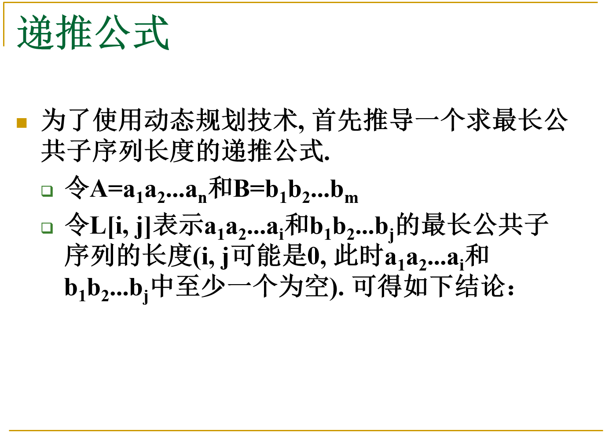
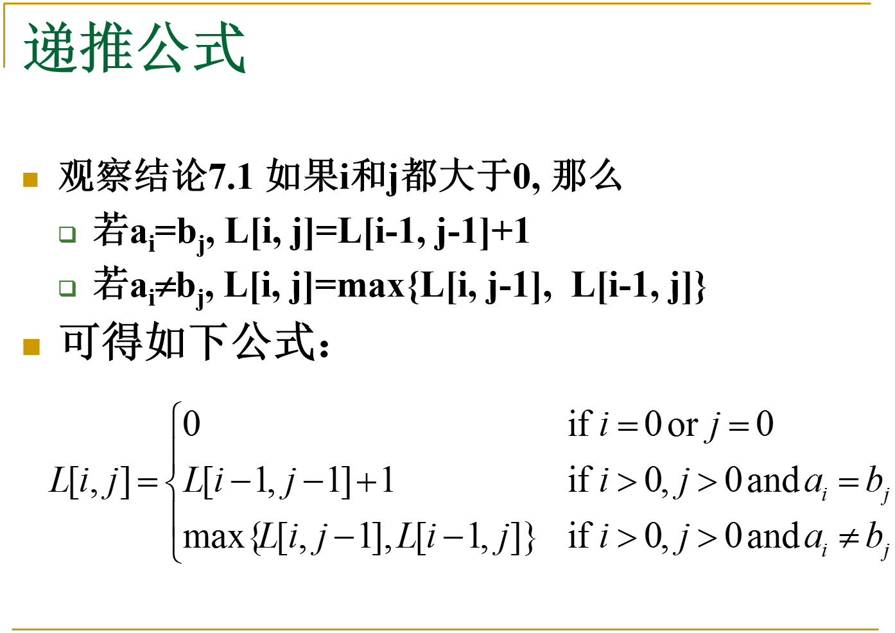

# 1143. Longest Common Subsequence




```cpp
  int longestCommonSubsequence(string A, string B) {
    A.insert(A.begin(), '#');
    B.insert(B.begin(), '#');
    vector<vector<int>> dp(A.size(), vector<int>(B.size(), 0));

    for (int i = 1; i < A.size(); i++) {
      for (int j = 1; j < B.size(); j++) {
        if (A[i] == B[j]) {
          dp[i][j] = dp[i - 1][j - 1] + 1;
        } else {
          dp[i][j] = max(dp[i - 1][j], dp[i][j - 1]);
        }
      }
    }
    return dp.back().back();
  }
```