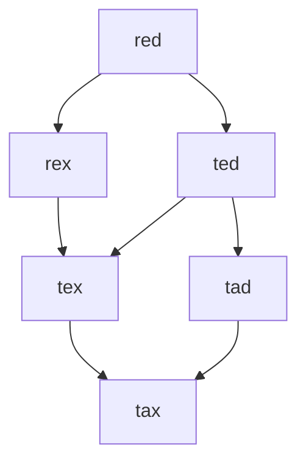
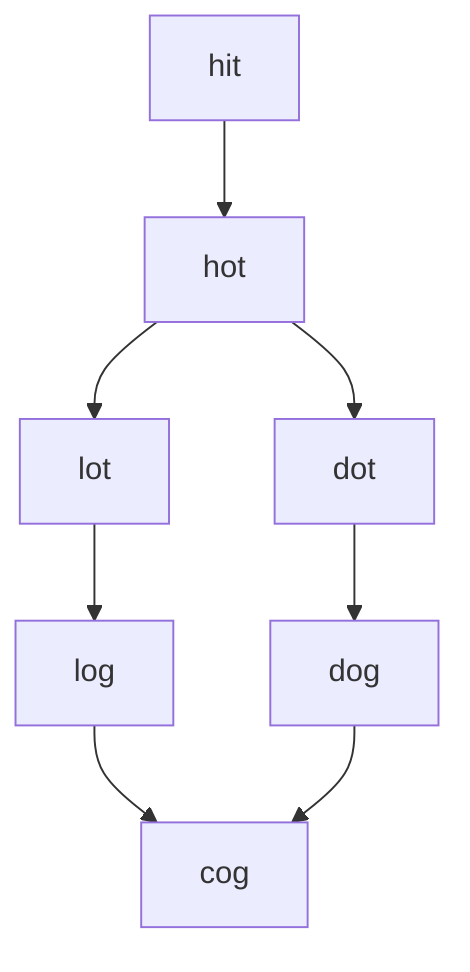

# 126. Word Ladder II
以`beginWord="red", endWord="tax", wordList=["ted", "tex", "red", "tax", "tad", "den", "rex", "pee"]`为例，我们需要构造这样一个图：


通过BFS建图，然后DFS+backtrace搜索出所有路径。建图的时候要注意以下几点：
1. 同层之间不能有连边。例如：`beginWord="hit", endWord="cog", wordList=["hot", "dot", "dog", "lot", "log", "cog"]`，图应该是这样的：

虽然"lot"和"dot"只差一个字符，但是他们相对于"hot"而言是在同一层，所以二者之间不能连边。

2. 邻居节点的确定：进行BFS时，对于每次从队首取出的`str`，它的邻居应该是那些与它距离为1的节点，只有这样的节点才能入队用于后续的遍历。所以我们需要记录每个节点的层数，作为建图的依据。用BFS建图时容易陷入这样的误区，即定义`visited`变量记录每个节点是否被访问过。这种思路是基于一个现成的图，而我们是在建图，所以不能这么做。

```cpp
class Solution {
 public:
  unordered_map<string, unordered_set<string>> graph;
  unordered_map<string, bool> visited;

  vector<vector<string>> findLadders(string beginWord, string endWord, vector<string>& wordList) {
    unordered_set<string> wordSet{ wordList.begin(), wordList.end() };
    int len = buildGraph(beginWord, endWord, wordSet);
    vector<vector<string>> paths;
    getPaths({}, paths, len, beginWord, endWord);

    return paths;
  }

  int buildGraph(string beginWord, string endWord, unordered_set<string> &wordSet) {
    if (wordSet.find(endWord) == wordSet.end()) {
      return 0;
    }
    queue<string> q;
    unordered_map<string, int> level;
    q.push(beginWord);
    level[beginWord] = 1;
    int len = 1;
    while (!q.empty()) {
      int n = q.size();
      while (n-- > 0) {
        string str = q.front();
        q.pop();
        if (str == endWord) {
          return len;
        }
        for (int i = 0; i < str.size(); i++) {
          string tmp = str;
          for (char c = 'a'; c <= 'z'; c++) {
            tmp[i] = c;
            if (tmp != str && wordSet.find(tmp) != wordSet.end()) {
              if (level[tmp] == 0 || level[tmp] == level[str] + 1) {
                // 如果没有记录过 tmp 的层数, 或者 tmp 就在 str 的下一层, 才能将 tmp 入队并加入到 str 的邻接表.
                q.push(tmp);
                level[tmp] = level[str] + 1;
                graph[str].insert(tmp);
              }
            }
          }
        }
      }
      len++;
    }
    return 0;
  }

  void getPaths(vector<string> path, vector<vector<string>> &paths, int len, string currWord, string endWord) {
    if (visited[currWord] || path.size() >= len) {
      return;
    }

    visited[currWord] = true;
    path.push_back(currWord);
    if (currWord == endWord) {
      paths.push_back(path);
    } else {
      for (const string &nextWord : graph[currWord]) {
        getPaths(path, paths, len, nextWord, endWord);
      }
    }
    visited[currWord] = false;
  }
};
```