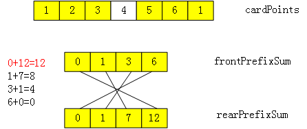

# 1423. Maximum Points You Can Obtain from Cards
## Solution 1: Sliding Window
```cpp
  // 每次只能从端点处取一张牌, 取 k 次使得点数之和最大. 将问题转化为:
  // 取 N - k 张连续的牌, 使得点数之和最小, 那么就能保证剩下的 k 张牌
  // 点数之和最大.
  // 证明: 设 N 张牌的点数之和为 M, N-k 张连续的牌点数之和为 x, 剩下
  // k 张牌点数之和为 y, 则 x+y=M. 要使 y 最大, 显然要使 x 最小.
  int maxScore(vector<int>& cardPoints, int k) {
    int sum = 0, score = 0, minScore = INT32_MAX, l = 0, r = 0;
    for (int n : cardPoints) {
      sum += n;
    }
    if (k == cardPoints.size()) {
      return sum;
    }
    
    k = cardPoints.size() - k;
    while (r < cardPoints.size()) {
      score += cardPoints[r];
      if (r - l + 1 == k) {
        minScore = min(score, minScore);
        score -= cardPoints[l++];
      }
      r++;
    }
    return sum - minScore;
  }
```

## Solution 2: Prefix Sum



```cpp
  int maxScore(vector<int>& cardPoints, int k) {
    int n = cardPoints.size();
    vector<int> frontPrefixSum(k + 1, 0);
    vector<int> rearPrefixSum(k + 1, 0);

    for (int i = 1; i <= k; i++) {
      frontPrefixSum[i] = frontPrefixSum[i - 1] + cardPoints[i - 1];
      rearPrefixSum[i] = rearPrefixSum[i - 1] + cardPoints[n - i];
    }

    int maxScore = 0;
    for (int i = 0; i <= k; i++) {
      maxScore = max(maxScore, frontPrefixSum[i] + rearPrefixSum[k - i]);
    }
    return maxScore;
  }
```