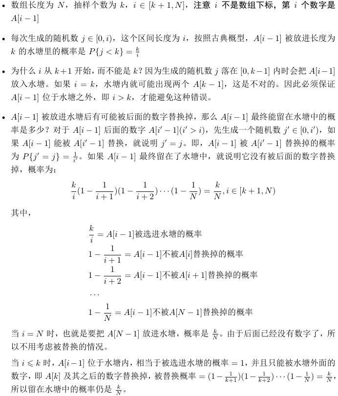

# 382. Linked List Random Node
```cpp
class Solution {
public:
  /** @param head The linked list's head.
      Note that the head is guaranteed to be not null, so it contains at least one node. */
  ListNode *head_;

  Solution(ListNode* head) : head_(head) {}

  /** Returns a random node's value. */
  int getRandom() {
    int val = head_->val;
    ListNode *p = head_;
    int k = 1;
    int i = k;
    while (p) {
      int j = rand() % i; // 生成一个 [0,i) 之间的随机数
      if (j < k) {
        val = p->val;
      }
      i++;
      p = p->next;
    }
    return val;
  }
};
```

水塘抽样算法解决的是从序列中随机选择`k`个数的问题：
```cpp
vector<int> sample(vector<int> &nums, int k) {
  vector<int> res(k);

  // 先预取 k 个
  for (int i = 0; i < k; i++) {
    res[i] = nums[i];
  }

  for (int i = k + 1; i <= nums.size(); i++) {
    int j = rand() % i; // 生成一个 [0,i) 之间的随机数
    if (j < k) {
      res[j] = nums[i - 1];
    }
  }
  return res;
}
```

证明：


通过下面的代码来验证，每个数字被选中的概率都是$\frac{k}{N}$：

```cpp
vector<int> sample(vector<int> &nums, int k) {
  vector<int> res(k);

  // 先预取 k 个
  for (int i = 0; i < k; i++) {
    res[i] = nums[i];
  }

  for (int i = k + 1; i <= nums.size(); i++) {
    int j = rand() % i; // 生成一个 [0,i) 之间的随机数
    if (j < k) {
      res[j] = nums[i - 1];
    }
  }
  return res;
}

vector<double> test_sample(vector<int> &nums, int k) {
  vector<double> probs(nums.size());
  unordered_map<int, int> counts;
  int epoch = 1000000;
  for (int i = 0; i < epoch; i++) {
    vector<int> res = sample(nums, k);
    for (int n : res) {
      counts[n]++;
    }
  }
  int n = 0;
  for (int i = 0; i < nums.size(); i++) {
    n += counts[nums[i]];
    probs[i] = double(counts[nums[i]]) / epoch;
  }
  return probs;
}

int main() {
  vector<int> nums = { 1, 2, 3, 4, 5 };
  int k;
  while (cin >> k) {
    auto res = test_sample(nums, k);
    printvec(res);
  }
}
```

输出：
```
1
[0.200151,0.199799,0.200366,0.200034,0.19965]
2
[0.400549,0.400196,0.399901,0.399227,0.400127]
3
[0.599909,0.599955,0.600479,0.600249,0.599408]
4
[0.79994,0.80023,0.799599,0.80005,0.800181]
5
[1,1,1,1,1]
```

对于长度为5的数组，当`k=1,2,3,4,5`时，每个数字被选中的概率都是均等的。