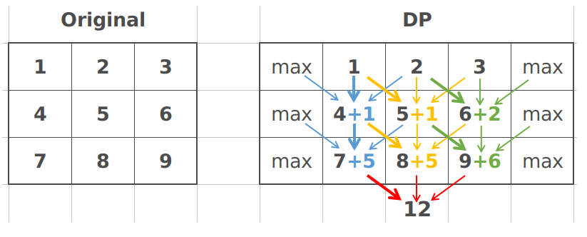

# 931. Minimum Falling Path Sum



***

```cpp
inline int min2(int& a, int &b)
{
    return (a < b) ? a : b;
}

inline int min3(int& a, int& b, int& c)
{
    int x = min2(a, b);
    int y = min2(b, c);
    return (x < y) ? x : y;
}

void printMatrix(vector<vector<int>>& m)
{
    for (int i = 0; i < m.size(); i++)
    {
        for (int j = 0; j < m[i].size(); j++)
        {
            cout << m[i][j] << " ";
        }
        cout << endl;
    }
}

// DP, no auxiliary array is used, modify A in-place
int minFallingPathSum(vector<vector<int>>& A) 
{
    int row = A.size(), col = A[0].size();

    for (int x = 1; x < row; x++)
    {
        for (int y = 0; y < col; y++)
        {
            if (y == 0) // 左边界
            {
                A[x][y] += min2(A[x-1][y], A[x-1][y+1]);
            }
            else if (y == col - 1) // 右边界
            {
                A[x][y] += min2(A[x-1][y-1], A[x-1][y]);
            }
            else
            {
                A[x][y] += min3(A[x-1][y-1], A[x-1][y], A[x-1][y+1]);
            }
        }
    }
    // 找到最后一行的最小值
    int ans = A[row-1][0];
    for (int i = 0; i < col; i++)
    {
        ans = min2(ans, A[row-1][i]);
    }
    //printMatrix(A);
    return ans;
}
```