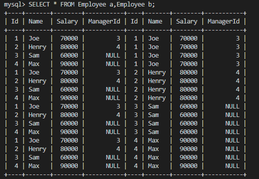
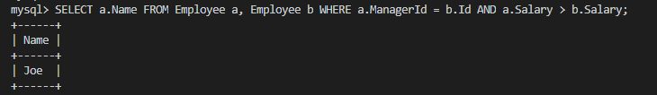

# 181. Employees Earning More Than Their Managers
## Approach #1: Using `WHERE` clause
首先考虑以下 SQL：

```sql
SELECT * FROM Employee a, Employee b;
```



在此基础上加上条件即可：

```sql
SELECT a.Name AS Employee FROM Employee AS a, Employee AS b
 WHERE a.ManagerId = b.Id AND a.Salary > b.Salary;
```

结果如下：



## Approach #2: Using `JOIN` clause
或者把`Employee`表和它自己`JOIN`起来：

```sql
SELECT a.Name AS Employee from Employee AS a JOIN Employee AS b
 WHERE a.ManagerId = b.Id AND a.Salary > b.Salary;
```