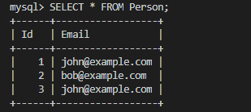
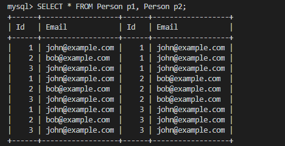
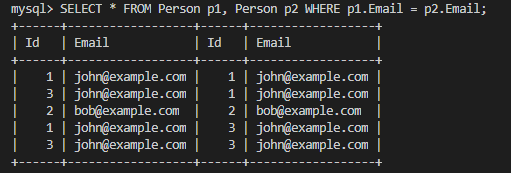
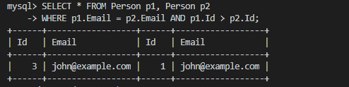
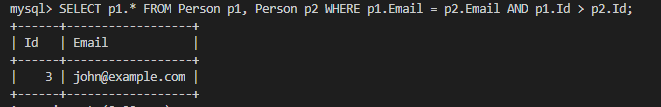
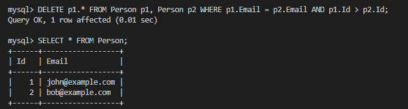

# 196. Delete Duplicate Emails
`Person`表如下：



先做一个笛卡尔积：



加上约束条件`p1.Email = p2.Email`：



从上述查询结果可知，对于`Person`表中`Email`字段重复的记录，在上述查询结果中的特征是`p1.Id != p2.Id`。在删除的时候我们需要删除的是后面的——也就是`Id`更大的一项。所以再在上述 SQL 添加一个约束条件`p1.Id > p2.Id`：





最后把`SELECT`改成`DELETE`就得到本题的解答：

```sql
DELETE p1.* FROM Person p1, Person p2
 WHERE p1.Email = p2.Email AND p1.Id > p2.Id;
```

