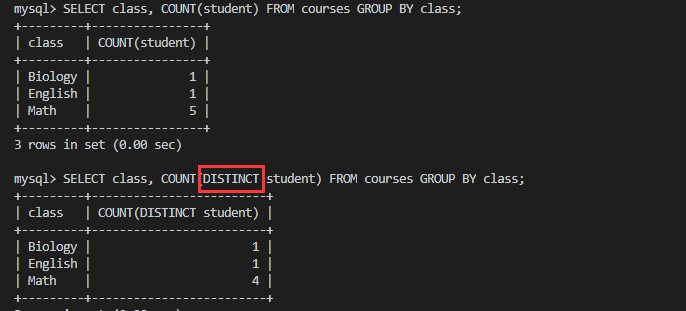

# 596. Classes More Than 5 Students
这题的关键是去重，比如：


也就是在调用`COUNT()`的时候去重：



所以不能直接在原表上`SELECT`，而应该这样写：

```sql
SELECT
    class
FROM
    (SELECT
        class, COUNT(DISTINCT student) AS n
     FROM
        courses
     GROUP BY class) AS temp
WHERE
    n >= 5
;
```